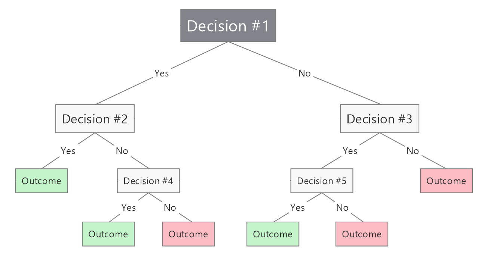
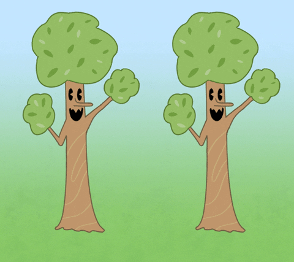
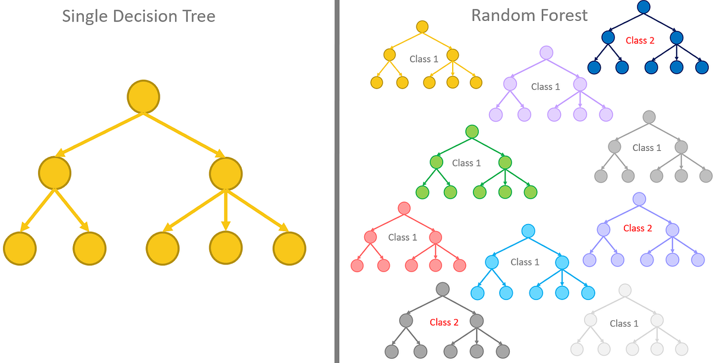
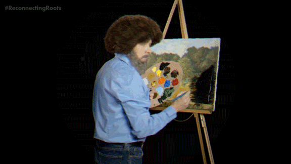
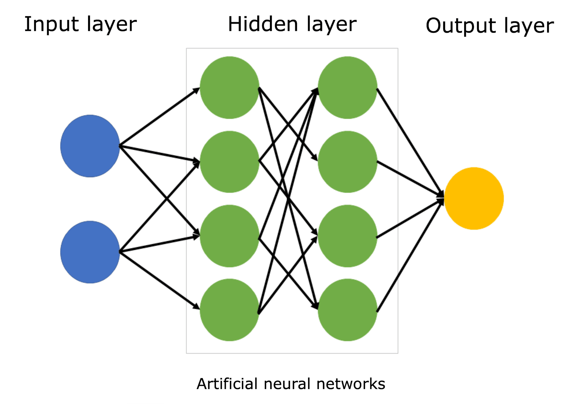
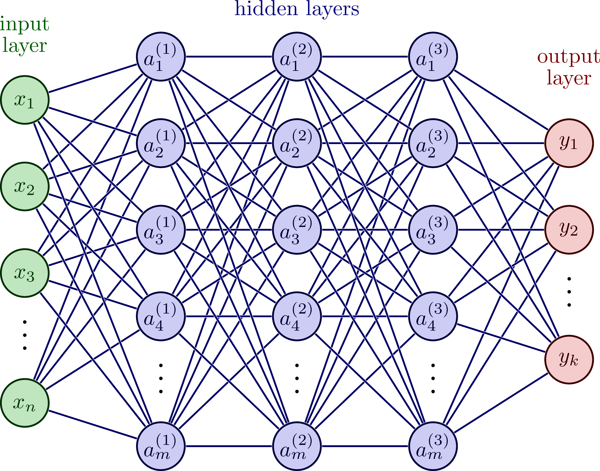

# Intro to ML

STAT 4714 — Michael Schwob

## 0.1 Why Machine Learning?

We just learned **simple linear regression**:\
$$
  y = \beta_0 + \beta_1 x + \epsilon
  $$

But what if:

- The relationship is *nonlinear*?
- We have *many* predictors?
- We want *prediction* more than interpretability?
- We need automated decisions from data?
- Then, ML might be a good route…

------------------------------------------------------------------------

## 0.2 What Is Machine Learning?

Machine learning = **models + algorithms** that learn patterns from data to make predictions. Alternatively, **ML = estimating a function**\
$$
f : \mathbb{R}^p \to \mathbb{R}
$$ that maps predictors to outcomes. Here, $\mathbb{R}^p$ denotes a $p$-dimensional input (e.g., $p$ covariates) and $\mathbb{R}$ denotes a one-dimensional output.

- Note that ML can also work for multivariate output (i.e., $y\in\mathbb{R}^m$).

------------------------------------------------------------------------

## 0.3 ML Is Not:

- A replacement for statistical thinking\
- “Black boxes” without assumptions\
- Magic ✨

------------------------------------------------------------------------

## 0.4 ML *is* a continuum:

- **Classical statistical models** (linear regression)
- **Regularized models** (ridge, lasso)
- **Nonlinear models** (trees, random forests)
- **Neural networks** (deep learning)

------------------------------------------------------------------------

## 0.5 Linear Regression as ML

Statistics perspective:

- Emphasis on **inference**, confidence intervals, hypothesis tests, etc.
- Interpret coefficients
- Assume a generative model

ML perspective:

- Regression is a **prediction algorithm**
- Optimize test error
- Tuned using validation or cross-validation

------------------------------------------------------------------------

## 0.6 Ex: Sunshine and Temperature

If we want to know how much sunshine affects temperature, the statistics perspective is most appropriate.

If we want to simply predict temperature tomorrow as accurately as possible, machine learning would be most appropriate.

------------------------------------------------------------------------

## 0.7 Machine Learning (Broadly)

Goal: $$
\hat f(\mathbf{x}) = \text{a model that predicts } y
$$

We observe:

- Inputs: $\mathbf{x}_i = (x_{i1}, \dots, x_{ip})$
- Output: $y_i$

Two (general) approaches:

1.  **Regression** → $y$ is continuous\
2.  **Classification** → $y$ is a category

Example from linear regression: - Predict tree volume from girth

# 1 Several ML Models

------------------------------------------------------------------------

## 1.1 Decision Trees

A **decision tree** is a predictive model that works by repeatedly asking simple yes/no questions about the input:

- “Is sunshine more than 3 hours?”
- “Is temperature below 70°F?”

Each question **splits the data** into more homogeneous groups.

Eventually, each path down the tree ends in a **prediction**.

**Idea:** Break the problem into small, easy decisions → make a prediction at the end.

------------------------------------------------------------------------

## 1.2 How Might It Predict Temperature

Imagine we want to predict temperature using sunshine.

A decision tree might learn rules like:

1.  **If sunshine \< 2 hours →** predict a cool day\
2.  **Else if sunshine \< 5 hours →** predict a mild day\
3.  **Else →** predict a warm day

You can think of it as a flowchart: Start at the top → follow the branches → reach a prediction.

------------------------------------------------------------------------

## 1.3 Visualizing Decision Trees

------------------------------------------------------------------------

## 1.4 How Does It Choose Splits?

The algorithm tries many possible questions/splits:

- “Is sunshine ≤ 3.2 hours?”
- “Is sunshine ≤ 5.7 hours?”

For each possible split, it checks:

- Does this question make the groups more similar?
- Does this reduce prediction error?

The algorithm picks the split that improves predictions the most. The tree is *automatically* learning which questions are most helpful.

------------------------------------------------------------------------

## 1.5 Trees vs. Linear Regression

**Linear Regression**:

- Learns a straight-line relationship between x and y\
- Best when interpretability matters\
- Assumes a smooth, linear pattern

**Decision Trees**:

- Learn a set of rules or thresholds\
- Best when patterns are nonlinear or complicated\
- Not designed for interpretability of slope/effect size

------------------------------------------------------------------------

## 1.6 Strengths of Decision Trees

- **Handle nonlinear patterns** easily\
  (splits can create curved or step-like shapes)

- **Handle interactions automatically**\
  (e.g., sunshine depends on wind → tree learns the combination)

- **Easy to explain**\
  (“The model predicts warm if sunshine \> 5 hours”)

- **Work with mixed data**\
  (numbers, categories, etc.)

- **No need for scaling or transformations**

------------------------------------------------------------------------

## 1.7 Limitations of Trees

- **Unstable:** A small change in the data can create a very different tree.

- **Overfitting:** If allowed to grow deep, trees memorize the training data.

- **Predictive performance:** A *single* tree is usually not the most accurate model…

------------------------------------------------------------------------

## 1.8 From a Single Tree to a Forest

**Idea**: What if instead of growing *one* tree, we grow *many* trees and let them vote?

This leads to a much more stable and accurate model.

------------------------------------------------------------------------

## 1.9 Why Many Trees Help

Each individual tree has its own quirks:

- It may split at slightly different values.
- It may overfit some parts of the data.
- It may miss certain patterns.

If we grow **lots** of trees, each one trained on slightly different data:

- Their **average prediction** is smoother and more reliable.
- Their **mistakes cancel out** (hopefully).
- The model becomes more accurate on new data.

This idea is called **ensemble learning**.

------------------------------------------------------------------------

## 1.10 Random Forests

A **random forest** is an ensemble of decision trees that uses two kinds of randomness:

1.  **Random data samples:** Each tree sees a different subset of the training data.

2.  **Random predictor choices:** At each split, a tree only looks at a random subset of predictors.

This forces trees to be different from each other and less likely to overfit.

Final prediction = **average of all trees**.

------------------------------------------------------------------------

## 1.11 Visualizing Random Forests

------------------------------------------------------------------------

## 1.12 Strengths of Random Forests

Random forests tend to:

- Predict extremely well\
- Handle nonlinear relationships effortlessly\
- Capture interactions automatically\
- Be robust to noise\
- Require almost no tuning\
- Work with mixed data types

------------------------------------------------------------------------

## 1.13 Strengths of Random Forests

They solve the two major problems of single trees:

- **Instability** → solved by averaging many trees\
- **Overfitting** → solved through randomness + averaging

------------------------------------------------------------------------

## 1.14 Beyond Trees and Forests

Random forests are powerful, but they have limits:

- Their predictions are “step-like” and not smooth.\
- They struggle with very complex patterns (like images or sound).\
- They can’t easily learn subtle curves, waves, and shapes.

**Idea**: What if we built a model that could combine simple building blocks over and over again to form very complex shapes?

- This leads us to **neural networks**.

------------------------------------------------------------------------

## 1.15 What Is a Neural Network?

A neural network is a stack of simple decision units.

Each unit:

1.  Takes some inputs,
2.  Transforms them in a simple way (like bending or stretching a line),
3.  Passes the result forward.

**Small transformations → combine into complex patterns.**

This allows neural networks to learn shapes and relationships that linear models and trees cannot.

------------------------------------------------------------------------

## 1.16 Analogy: Drawing with Matches

One match gives a straight line. Two matches let you make a corner. Many matches let you form curves, waves, and spirals.

A neural network works the same way: each “match” is a small, simple transformation, and linking many of them allows the model to learn very flexible shapes.

------------------------------------------------------------------------

## 1.17 Visualizing Neural Networks

$$
\hat y = f(\mathbf{x};\ \text{weights},\ \text{activations})
$$

- Layers of transformations/nonlinear activation functions\
- Learn patterns through optimization

------------------------------------------------------------------------

## 1.18 Visualizing Neural Networks

------------------------------------------------------------------------

## 1.19 Strengths of Neural Networks

Neural networks can:

- Learn smooth curves\
- Learn complicated nonlinear shapes\
- Capture interactions automatically\
- Scale to big datasets\
- Power modern technologies like speech recognition and image classification

------------------------------------------------------------------------

## 1.20 Strengths of Neural Networks

They are especially useful when:

- Patterns are subtle\
- Data is high-dimensional\
- Simpler models cannot capture the relationship

------------------------------------------------------------------------

## 1.21 Limitations of Neural Networks

- **Hard to interpret**: They do not give clear “effects” like slopes.
- **Need lots of data** to avoid memorizing the training set.
- **Require tuning**: layers, units, activation functions, etc.
- **More computationally demanding** than regression, trees, or forests.

------------------------------------------------------------------------

## 1.22 How These Models Fit Together

**Simple Linear Regression**

- Learn a straight-line relationship.

**Decision Trees/Random Forests**

- Learn rules and thresholds.
- Combine many trees for better accuracy.

**Neural Networks**

- Learn smooth, complex shapes through layered transformations.

# 2 Topics to Explore on Your Own

------------------------------------------------------------------------

## 2.1 Overfitting

Overfitting happens when a model:

- Learns the **training data too well**\
- Performs poorly on **new data**

Why this matters:

- More flexible models (trees, forests, neural nets) can easily overfit.
- Good predictive modeling requires finding the right balance: **complex enough to capture patterns,\
  simple enough to generalize.**

------------------------------------------------------------------------

## 2.2 Regularization

Regularization is a family of techniques that help prevent overfitting.

Ideas to look into:

- **Ridge regression** (shrinks coefficients)
- **Lasso regression** (shrinks + selects)
- **Elastic Net** (combination of both)

Regularization helps:

- Stabilize models\
- Improve generalization

------------------------------------------------------------------------

## 2.3 Implementation

R packages to explore:

- `tidymodels` (unified ML grammar)
- `rpart` (decision trees)
- `randomForest` and `ranger` (random forests)
- `keras` (neural networks)

Python libraries to explore:

- `scikit-learn` (the ML “standard library”)
- `xgboost`, `lightgbm`, `tensorflow`, and `pytorch`

------------------------------------------------------------------------

## 2.4 Feature Engineering

Feature engineering is the process of creating useful inputs ($\mathbf{x}$) to help models learn better. Better features often improve prediction more than switching to a more complicated model.

Examples:

- Turning dates into weekday/weekend
- Converting text into word counts
- Creating polynomial or interaction terms
- Scaling or normalizing numeric variables

------------------------------------------------------------------------

## 2.5 Model Evaluation

Great predictive modeling comes from measuring performance correctly.

Concepts to explore:

- Train, validation, and test sets
- Cross-validation (k-fold)
- Bias–variance tradeoff
- Metrics for regression vs. classification
  - Regression: RMSE, MAE
  - Classification: accuracy, ROC curves

------------------------------------------------------------------------

## 2.6 Responsible ML

As ML systems become more common, so do ethical questions.

Topics to explore:

- Bias and fairness in algorithms\
- Privacy and data protection\
- Transparency and interpretability\
- How ML decisions affect people in real life

Understanding responsibility is as important as understanding implementation.

------------------------------------------------------------------------

## 2.7 Key Takeaways

- ML formalizes prediction as **learning a function**\
- SLR is a simple ML model
- Ensembles and neural networks extend prediction capabilities\
- Interpretation ↓ as complexity ↑
