# Simple Linear Regression

STAT 4714 — Michael Schwob

## 0.1 Goals for this Lecture

- Understand simple linear regression
- Learn how to fit a simple linear regression model
- Use hypothesis testing to test for linear relationships
- Learn some data transformations
- Learn how to diagnose a fitted regression via residual analysis

# 1 Establishing a Foundation

------------------------------------------------------------------------

## 1.1 Why Linear Regression?

Linear regression is:

- used to explore the relationship between variables
- used to make predictions
- widely used across all scientific domains
- the foundation for many advanced statistical concepts, such as linear modeling and machine learning

------------------------------------------------------------------------

## 1.2 Some Definitions

In linear regression, we relate a **dependent variable** to **independent variables**. The **dependent variable** is the response $y$ that *depends* on the values of the **independent variables** $x$. In linear regression, we often assume the relationship $$y=\beta_0+\beta_1x,$$ where $\beta_0$ is the **intercept** and $\beta_1$ is the **slope**. This relationship is *linear* because the variables are linearly related (e.g., a linear combination).

------------------------------------------------------------------------

## 1.3 Visualizing the Linear Relationship

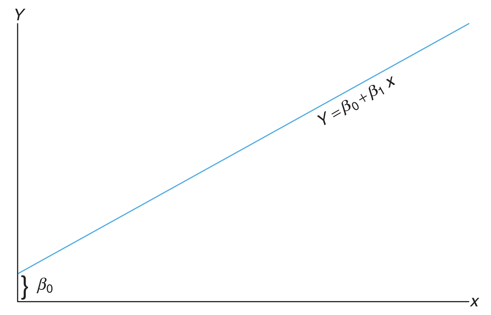

An example of a linear regression.

------------------------------------------------------------------------

## 1.4 Deterministic vs Stochastic

The linear relationship $$y=\beta_0+\beta_1x$$ is **deterministic**; $y$ will never change so long as $x$ does not change. However, we are in a statistics class, so we are legally obligated to discuss stochasticity…

- In the real world, many scientific and engineering phenomena are stochastic. That is, a given $x$ does not always give the same value for $y$…

------------------------------------------------------------------------

## 1.5 Inducing Stochasticity

To account for stochasticity, we introduce the random variable $\epsilon$: $$Y=\beta_0+\beta_1x+\epsilon,$$ where $\epsilon$ is assumed to be distributed with $E(\epsilon)=0$ and $\text{Var}(\epsilon)=\sigma^2$. We call this equation the **simple linear regression model** and we call $\sigma^2$ the error variance or **residual variance**.

- We will add more independent variables next lecture, yielding a **multiple linear regression model**.

------------------------------------------------------------------------

## 1.6 So what?

The concept of **regression analysis** concerns finding the best relationship between $Y$ and $x$ and quantifying the strength of that relationship using regression methods.

- Linear regression is applicable when it is assumed that there is a linear relationship between the dependent variable and the independent variables.
- We start with **simple linear regression** to build up a regression toolbox, which can be easily expanded!

------------------------------------------------------------------------

## 1.7 Simple Linear Regression

So, our simple linear regression (SLR) model is $$Y=\beta_0+\beta_1x+\epsilon$$

- $Y$ is a random variable because $\epsilon$ is random.
- The value $x$ of the independent variable is *not* random, though it may be measured with error.
- We call $\epsilon$ the **random error**. We often assume $\epsilon$ has constant variance; we call this the *homogeneous variance assumption*.

------------------------------------------------------------------------

## 1.8 The Random Error

The presence of the random error $\epsilon$ prevents the SLR model from being deterministic. Because $\epsilon$ is random, the same value for $x$ might give different values for $Y$. However, because $E(\epsilon)=0$, we expect that $$E(Y)=\beta_0+\beta_1x+E(\epsilon)=\beta_0+\beta_1x.$$ Therefore, at a specific value of $x$, the expected response is distributed around the *true regression line* $y=\beta_0+\beta_1x$.

- Unfortunately, we do not observe $\epsilon$…

------------------------------------------------------------------------

## 1.9 What Do We Observe?

In SLR, we only observe the set $\{(x_i,y_i): i=1,2,\dots,n\}$, which are $n$ sets of observations. We *do not* observe the **regression coefficients** $\{\beta_0,\beta_1\}$ nor the error variances $\{\epsilon_i: i=1,2,\dots,n\}$. Without knowing the regression coefficients, how can we know the relationship between the dependent and independent variables?

- **Our goal**: Estimate $\beta_0$ and $\beta_1$!

------------------------------------------------------------------------

## 1.10 Estimating the Regression Line

Ultimately, we want to estimate the regression line. We call our estimate the **fitted regression** line $$\hat{y}=b_0+b_1x,$$ where $\hat{y}$ is the predicted (or “fitted”) value and $b_0$ and $b_1$ are our estimates for $\beta_0$ and $\beta_1$, respectively. The fitted line is an estimate of the true regression line $y=\beta_0+\beta_1x$.

- Importantly, we expect our fitted line to be closer to the true regression line as $n\to\infty$.

------------------------------------------------------------------------

## 1.11 Visualizing Random Errors

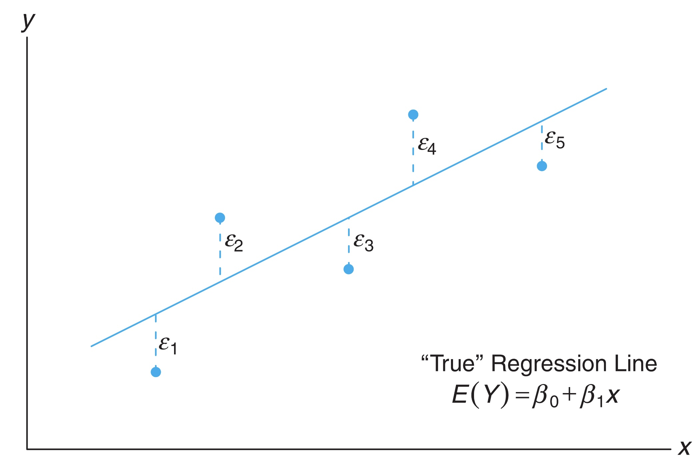

A regression line with model errors $\epsilon_i$.

------------------------------------------------------------------------

## 1.12 Ex: Tannery Wastes

Tannery wastes are chemically complex and characterized by high values of chemical oxygen demand, volatile solids, and other pollution measures. Consider experimental data that were obtained from 33 samples of chemically treated tannery waste in a study conducted at Virginia Tech. Readings on $x$ (the percent reduction in total solids) and $y$ (the percent reduction in chemical oxygen demand) were recorded.

- We want to learn the *linear* relationship between $y$ and $x$ via a SLR!

------------------------------------------------------------------------

## 1.13 Ex: Tannery Wastes

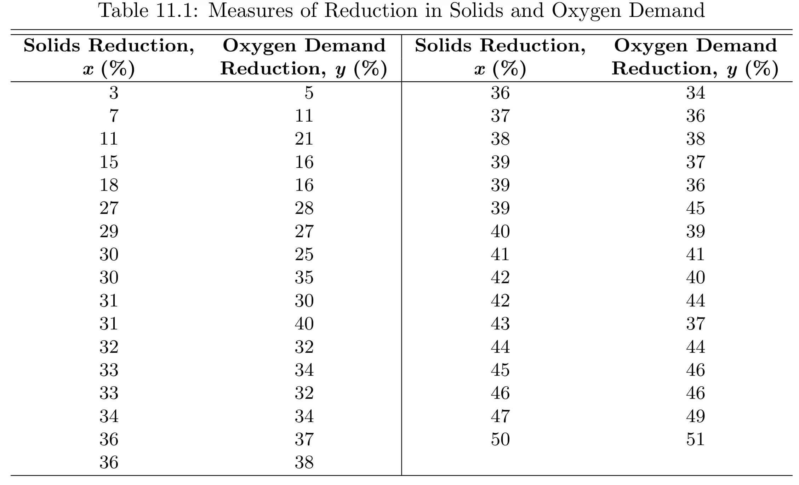

Tannery data.

------------------------------------------------------------------------

## 1.14 Ex: Tannery Wastes

Suppose we estimate the fitted line $\hat{y}=b_0+b_1x$:

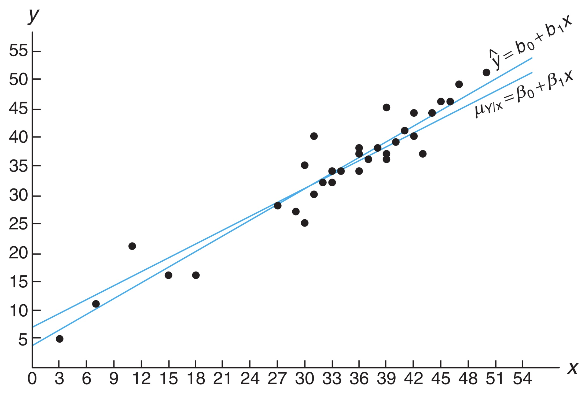

The fitted regression and the true regression line.

- Now, let’s see how to actually estimate the fitted line!

# 2 Estimating the Fitted Line via Least Squares

------------------------------------------------------------------------

## 2.1 One (Popular) Idea

A popular approach to estimating the fitted line is to minimize the errors that we might make. For example, consider the **residual** $$e_i=y_i-\hat{y}_i,$$ which denotes the difference between the observed value $y_i$ and the predicted value $\hat{y}_i$ for $i=1,\dots,n$. Here, the residual is one example of how we might define *error*; it is an error in the fit of the model $\hat{y}_i=b_0+b_1x_i$.

------------------------------------------------------------------------

## 2.2 Visualizing Residuals and Errors

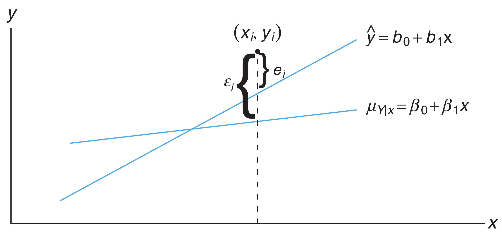

A visual comparison between model errors $\epsilon_i$ and residuals $e_i$.

------------------------------------------------------------------------

## 2.3 Method of Least Squares

If we obtain residuals $e_i$ for every pair of observations $(x_i,y_i)$, then we might want to minimize the overall amount of residuals. This leads us to our new goal:

- **Goal**: Compute $b_0$ and $b_1$ such that the sum of the squared residuals, or **sum of squared errors (SSE)**, is minimized: $$SSE=\sum^n_{i=1}e_i^2=\sum^n_{i=1}(y_i-\hat{y}_i)^2$$ This is called the **method of least squares**.

------------------------------------------------------------------------

## 2.4 Method of Least Squares

Differentiating $SSE$ with respect to $b_0$ and $b_1$, we get $$\frac{\partial(SSE)}{\partial b_0}=-2\sum^n_{i=1}(y_i-b_0-b_1x_i), \\ \frac{\partial(SSE)}{\partial b_1}=-2\sum^n_{i=1}(y_i-b_0-b_1x_i)x_i.$$ Then, we set the partial derivatives equal to $0$ and rearrange terms…

------------------------------------------------------------------------

## 2.5 Normal Equations

… to get the **normal equations** $$nb_0+b_1\sum^n_{i=1}x_i=\sum^n_{i=1}y_i, \\ b_0\sum^n_{i=1}x_i+b_1\sum^n_{i=1}x_i^2=\sum^n_{i=1}x_iy_i,$$ which we solve to get $$b_1=\frac{\sum^n_{i=1}(x_i-\bar{x})(y_i-\bar{y})}{\sum^n_{i=1}(x_i-\bar{x})^2},\quad b_0=\bar{y}-b_1\bar{x}.$$

------------------------------------------------------------------------

## 2.6 Ex: Estimating $b_0$ and $b_1$ in `R`

Code

``` r
## simulate data
set.seed(702)
n <- 25 # number of samples
x <- rnorm(n, 5, 1.3) # random x values
y <- 0.2 + 1.3*x + rnorm(n, 0, 0.2) # beta_0=0.2, beta_1=1.3, epsilon_i=rnorm(1,0,0.2)

## method of least squares estimates
b1 <- sum((x-mean(x))*(y-mean(y)))/sum((x-mean(x))^2)
b0 <- mean(y) - b1*mean(x)
c(b0 = b0, b1 = b1) # pretty close to the truth!
```

           b0        b1 
    0.2022517 1.3020455 

------------------------------------------------------------------------

## 2.7 Other Possible Approaches

We aren’t limited to minimizing SSE to estimate $b_0$ and $b_1$; we could instead minimize any of the following with respect to $b_0$ and $b_1$:

- $\sum^n_{i=1}|y_i-\hat{y}_i|$
- $\sum^n_{i=1}(y_i-\hat{y}_i)^6$
- … and so on

In minimizing SSE, we produce a fitted line that *minimizes the sum of squares of vertical deviations* from the observed points to the line.

------------------------------------------------------------------------

## 2.8 Residuals as Vertical Deviations

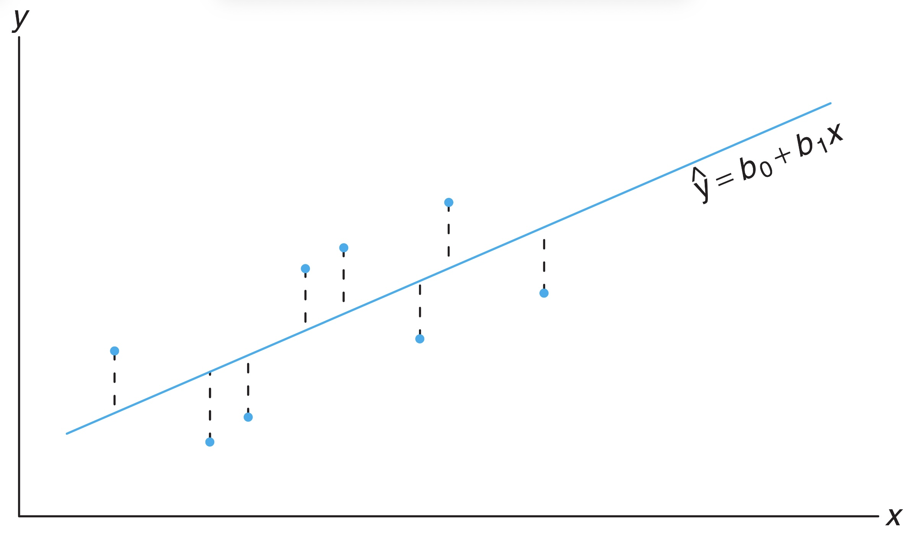

Residuals represented as vertical dashed lines from the fitted regression line.

------------------------------------------------------------------------

## 2.9 Fitting a SLR Model in `R`

We can automatically fit a SLR model in R using the `lm()` function!

Code

``` r
## simulate data
set.seed(702)
n <- 25 # number of samples
x <- rnorm(n, 5, 1.3) # random x values
y <- 0.2 + 1.3*x + rnorm(n, 0, 0.2) # beta_0=0.2, beta_1=1.3, epsilon_i=rnorm(1,0,0.2)

## using the lm() function
lm_fit <- lm(y ~ x)
lm_fit$coefficients # same estimates as our manual computations!
```

    (Intercept)           x 
      0.2022517   1.3020455 

------------------------------------------------------------------------

## 2.10 Breakout \#1

Code

``` r
## simulate data; do not change!!
set.seed(702)
n <- 25 # number of samples
x <- rnorm(n, 5, 1.3) # random x values
y <- 5.2 + 3.1*x + rnorm(n, 0, 100.2) # beta_0=5.2, beta_1=3.1, epsilon_i=rnorm(1,0,100.2)
```

1.  Using the simulated data, manually estimate $b_0$ and $b_1$ using the method of least squares. Compare this to the output of the `lm()` function.
2.  Now, estimate $\beta_0$ and $\beta_1$ by minimizing $\sum^n_{i=1}|y_i-\hat{y}_i|$. How does this compare to your answers in (1)?
3.  Why might your estimates in (1) and (2) not be close to the true values?

# 3 Sampling Distributions of $\beta_0$ and $\beta_1$

------------------------------------------------------------------------

## 3.1 Motivating the Use of Sampling Distributions

Now that we know how to estimate $\beta_0$ and $\beta_1$, we may also be interested in knowing the variability of our estimates or whether our estimated values are “significant” (e.g., if knowing the linear relationship between $x$ and $y$ is helpful for estimating $y$).

- We can investigate such things using sampling distributions!

------------------------------------------------------------------------

## 3.2 Repeated Sampling

If we repeatedly collect new samples of $(x_i, y_i)$ pairs, each fitted line $\hat{y} = b_0 + b_1x$ will differ slightly.

- The estimates $b_0$ and $b_1$ vary from sample to sample.
- Their distributions are centered around the true values $\beta_0$ and $\beta_1$.
- The spread of these distributions are summarized by $\text{SE}(b_0)$ and $\text{SE}(b_1)$.

------------------------------------------------------------------------

## 3.3 Ex: Variability of $b_1$

With the same data $\mathbf{x}=(x_1,\dots,x_n)'$ and fixed (“true”) model parameters, each simulation of $\mathbf{y}=(y_1,\dots,y_n)'$ may be different, resulting in different estimates for $\beta_0$ and $\beta_1$.

Code

``` r
## simulate data
set.seed(702)
n <- 40 # number of observations
beta0 <- 0.5; beta1 <- 1.2; sigma <- 1.0 # true parameter values
x <- seq(-2, 2, length.out = n) # fixed x

## repeated sampling of y and refit model each time
B <- 4000; b1_hat <- numeric(B); b0_hat <- numeric(B); se_b1 <- numeric(B) # model-based SE(b1) from each refit
for (b in 1:B) {
  y <- beta0 + beta1 * x + rnorm(n, 0, sigma) # obtain sample
  coeff <- coef(summary(lm(y~x)))
  b0_hat[b] <- coeff["(Intercept)", "Estimate"]
  b1_hat[b] <- coeff["x", "Estimate"]
  se_b1[b] <- coeff["x", "Std. Error"]
}

## plot sampling distribution
hist(b1_hat, breaks = 40, freq = TRUE,
main = "Sampling Distribution for beta_1", xlab = "Estimate",
col = "grey85", border = "white")
abline(v = beta1, col = 2, lwd = 2)
```

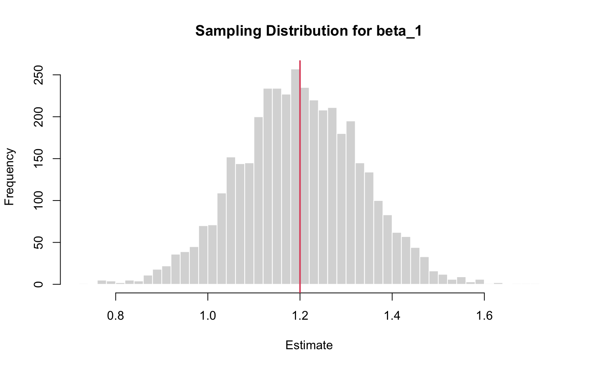

Sampling distribution of $b_1$ with the same data **x** and model parameters.

------------------------------------------------------------------------

## 3.4 Testing Whether $\beta_1=0$

If $\beta_1 = 0$, then $y$ does not (linearly) depend on $x$. Large observed slopes are unlikely under the scenario $\beta_1=0$, so we can use the sampling distribution of $b_1$ to decide whether our observed slope is plausible under $\beta_1 = 0$. In other words, let’s use a sampling distribution to test $$H_0: \beta_1=0,\quad H_a: \beta_1\ne 0,$$ which ultimately tests if there is a linear relationship between $y$ and $x$.

- Just when you thought we were done with hypothesis testing…

------------------------------------------------------------------------

## 3.5 Randomization Test

We can test $H_0: \beta_1=0$ by assuming the null and comparing the resulting sampling distribution to the observed $b_1$.

- Assuming the null, we say that there is not a relationship between $x_i$ and $y_i$. So, we can shuffle the pairs $(x_i,y_i)$ arbitrarily because it doesn’t matter which $x$ goes with which $y$ under $H_0$.
  - This is similar to the two-sample permutation test! Let’s see an example…

------------------------------------------------------------------------

## 3.6 Ex: Hypothesis Testing for $\beta_1$

Code

``` r
## simulate data
set.seed(702)
y_obs <- beta0 + beta1*x + rnorm(n, 0, sigma) # same model parameters as before
fit_obs <- lm(y_obs ~ x)
b1_obs <- coef(fit_obs)[2] # observed estimate for beta_1

## build the null distribution by shuffling y relative to x (like the permutation test)
Bnull <- 5000
b1_null <- numeric(Bnull)
for(b in 1:Bnull) {
  y_perm <- sample(y_obs, replace = FALSE) # shuffling which x goes with which y
  b1_null[b] <- coef(lm(y_perm ~ x))[2]
}

## two-sided p-value
p_val <- mean(abs(b1_null) >= abs(b1_obs))
c(b1_observed = b1_obs, p_value_two_sided = p_val)
```

        b1_observed.x p_value_two_sided 
             1.394193          0.000000 

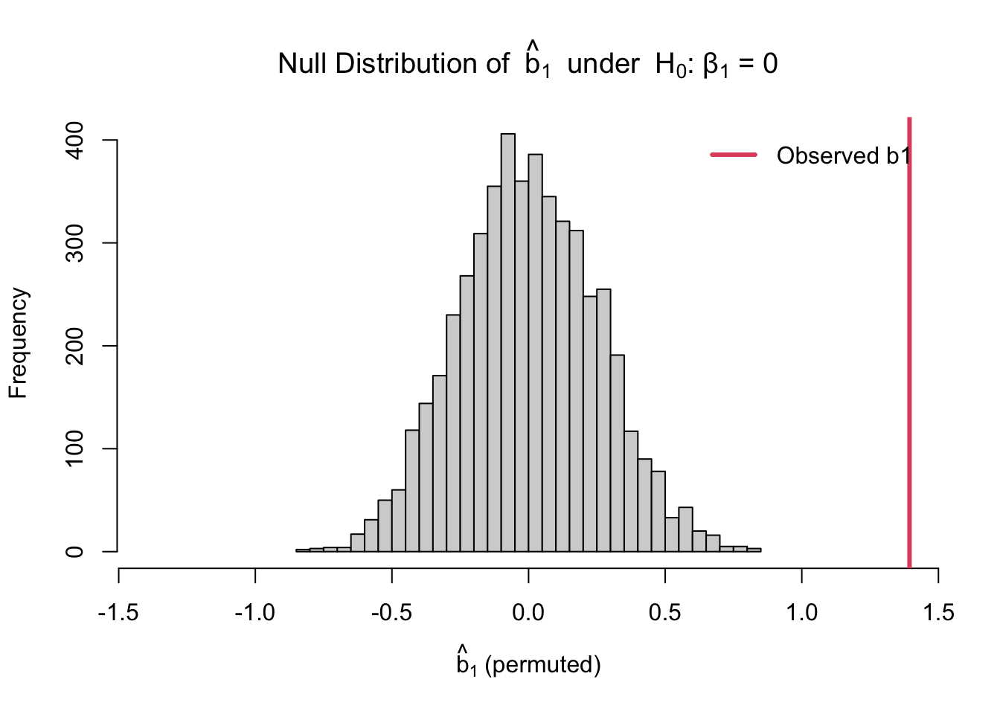

Randomization test for H0: β1 = 0. Clearly, our observed value is an anomaly assuming the null, so we will reject H0. Thus, there is a significant linear relationship between x and y!

------------------------------------------------------------------------

## 3.7 Notes on the Randomization Test

The randomization test, like the two-sample permutation test, is nonparametric! We do not need to make any assumptions. Given data $\{(x_i,y_i):i=1,\dots,n\}$, we simply shuffle the data, reassigning which $x$’s go with which $y$’s.

- Once we build the randomization sampling distribution, we can compute $p$-values and confidence intervals like we did previously!

------------------------------------------------------------------------

## 3.8 Decision Making

It’s important to note that if we fail to reject $H_0: \beta_1=0$, that does **not** mean there is not a relationship between $x$ and $y$. The relationship could be nonlinear! However, if $H_0$ is rejected, there is evidence that the linear term in $x$ explains a significant portion of variability in $y$.

- There could *also* be a nonlinear relationship between $x$ and $y$, even if we reject $H_0$.
- Maybe, we’re interested in knowing how much of the variability of $y$ is explained by the fitted linear model…

# 4 Coefficient of Determination

------------------------------------------------------------------------

## 4.1 Measures of Variation

Let’s consider two measures of variation, the sum of square errors (SSE) and the total corrected sum of squares (SST): $$SSE=\sum^n_{i=1}(y_i-\hat{y}_i)^2,\\ SST=\sum^n_{i=1}(y_i-\bar{y})^2,$$ where SSE measures the variation due to error and SST measures the variation in the response values that ideally would be explained by the model.

------------------------------------------------------------------------

## 4.2 Visualizing Variation

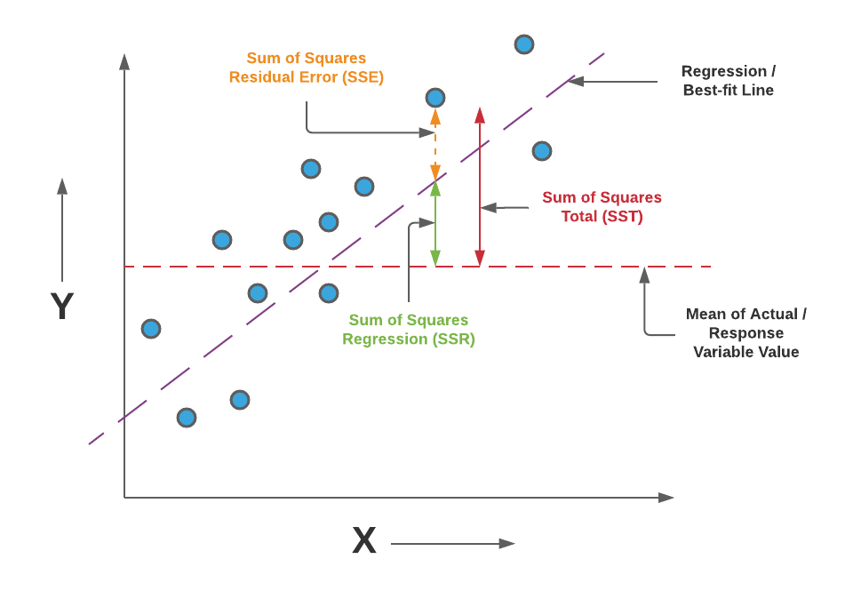

Comparing SST, SSE, and SSR.

------------------------------------------------------------------------

## 4.3 Coefficient of Determination

The quantity that represents explained variation is $$SSR=SST-SSE=\sum^n_{i=1}(\hat{y}_i-\bar{y})^2.$$ Therefore, the proportion of variability explained by the fitted model is $$R^2=\frac{SST-SSE}{SST}=1-\frac{SSE}{SST},$$ which we call the **coefficient of determination**.

------------------------------------------------------------------------

## 4.4 Understanding $R^2$

$R^2$ compares how much variability our model explains to how much total variability existed to begin with:

$$
R^2 = 1 - \frac{SSE}{SST} = \frac{SSR}{SST}.
$$

- If $R^2 = 0$, the model explains **none** of the variability (no better than the mean).
- If $R^2 = 1$, the model explains **all** of the variability (perfect fit).

------------------------------------------------------------------------

## 4.5 Visualizing $R^2$

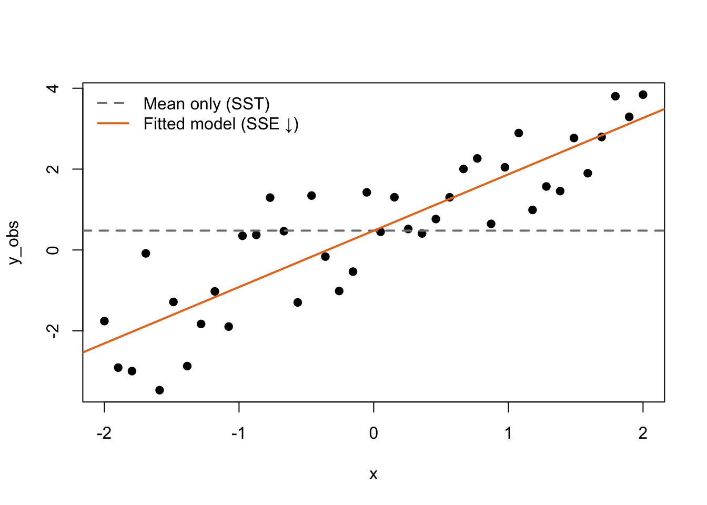

------------------------------------------------------------------------

## 4.6 Visualizing $R^2$

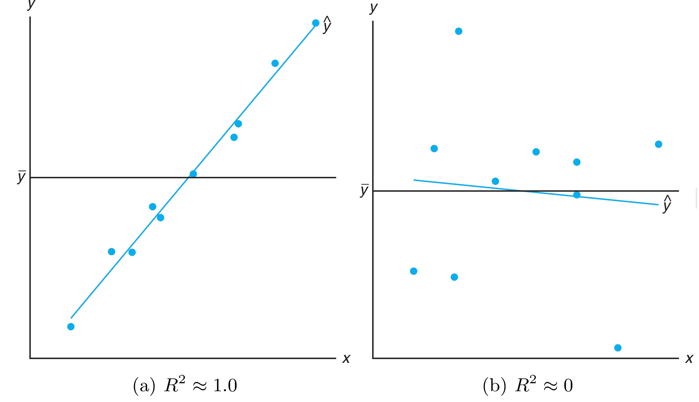

Left: A perfectly fit linear model. Right: A terribly fit linear model.

------------------------------------------------------------------------

## 4.7 Using $R^2$

Analysts often report values of $R^2$ due to its simplicity; it quantifies how much our linear model explains the relationship of our observed data. A perfect model results in zero-valued residuals, so $R^2=1.0$ is the “best” possible value.

- However, using $R^2$ to solely discuss model fit is tricky. What is an appropriate $R^2$ depends on the application.
- Additionally, you can artificially increase $R^2$ by adding more terms to your model – even if those terms aren’t helpful. (This is called **overfitting**.)

------------------------------------------------------------------------

## 4.8 Obtaining $R^2$ in `R`

Code

``` r
## simulate data
set.seed(702)
y_obs <- beta0 + beta1*x + rnorm(n, 0, sigma) # same model parameters as before
fit_obs <- lm(y_obs ~ x)
summary(fit_obs)$r.squared
```

    [1] 0.7689628

Therefore, in this example, approximately 77% of the variability in $y$ is explained by our fitted model. This means the fitted line reduces unexplained variability by 77% compared to simply using the mean of $y$ as a predictor.

# 5 Predictions

------------------------------------------------------------------------

## 5.1 Making Predictions

A common goal in statistical analyses is to predict responses. Given some data point $x_0$, what $y_0$ might we expect? There are two approaches to answering this question:

1.  We can estimate the mean response $\mu_{Y| x_0}$, which represents the average response we’d get with the data point $x_0$. We use *confidence intervals* in this approach.
2.  We can predict a specific $y_0$ given $x_0$. We use *prediction intervals* in this approach.

------------------------------------------------------------------------

## 5.2 Confidence Intervals for $\mu_{Y| x_0}$

We can obtain the confidence interval for the mean response $\mu_{Y| x_0}$ via bootstrap sampling distributions! The idea is to simulate possible mean responses for a given $x_0$.

- We randomly assign residuals to the predicted responses to simulate possible observations: $y^*_i=\hat{y}_i+e^*_i$, where $e_i^*$ is a randomly selected **observed** residual.
- We do this because we want to simulate responses without assuming the distribution of the residuals.
- This approach assumes the residuals are independent and identically distributed.

------------------------------------------------------------------------

## 5.3 Confidence Intervals for $\mu_{Y| x_0}$

1.  For each bootstrapped sample, we resample the residuals with replacement. This imitates drawing new noise (deviations) from what we saw in our sample.
2.  Create the new responses $y^*_i=\hat{y}_i+e_i^*$, where $e_i^*$ is a randomly sampled residual.
3.  Refit the model on $(\mathbf{x},\mathbf{y}^*)$ to get new estimates $b_0^*$ and $b_1^*$.
4.  Compute the bootstrapped mean response at $x_0$: $b_0^*+b_1^*x_0$ to build a bootstrap sampling distribution.

------------------------------------------------------------------------

## 5.4 Ex: 95% Confidence Interval for $\mu_{Y| x_0}$

Code

``` r
## obtained "observed" sample
set.seed(702)
fit <- lm(y_obs ~ x)
ehat <- resid(fit) # residuals
yhat <- fitted(fit) # predictions
x0 <- 0.75 # new value to be studied

## bootstrap sampling distribution
B <- 3000
mu_star <- numeric(B) # mean response at y0 = b0* + b1* x0
for(b in 1:B){
  y_star <- yhat + sample(ehat, n, replace = TRUE) # randomly sample residuals
  fit_star <- lm(y_star ~ x) # fit model on adjusted responses
  coeff <- coef(fit_star) # fitted regression coefficients
  mu_star[b] <- coeff[1] + coeff[2]*x0
}

## 95% percentile CI for the mean response at x0
ci_mean <- quantile(mu_star, c(0.025, 0.975))
c(mean_hat = unname(coef(fit)[1] + coef(fit)[2]*x0),
  ci_lower = ci_mean[1], ci_upper = ci_mean[2])
```

          mean_hat  ci_lower.2.5% ci_upper.97.5% 
          1.524105       1.190480       1.857405 

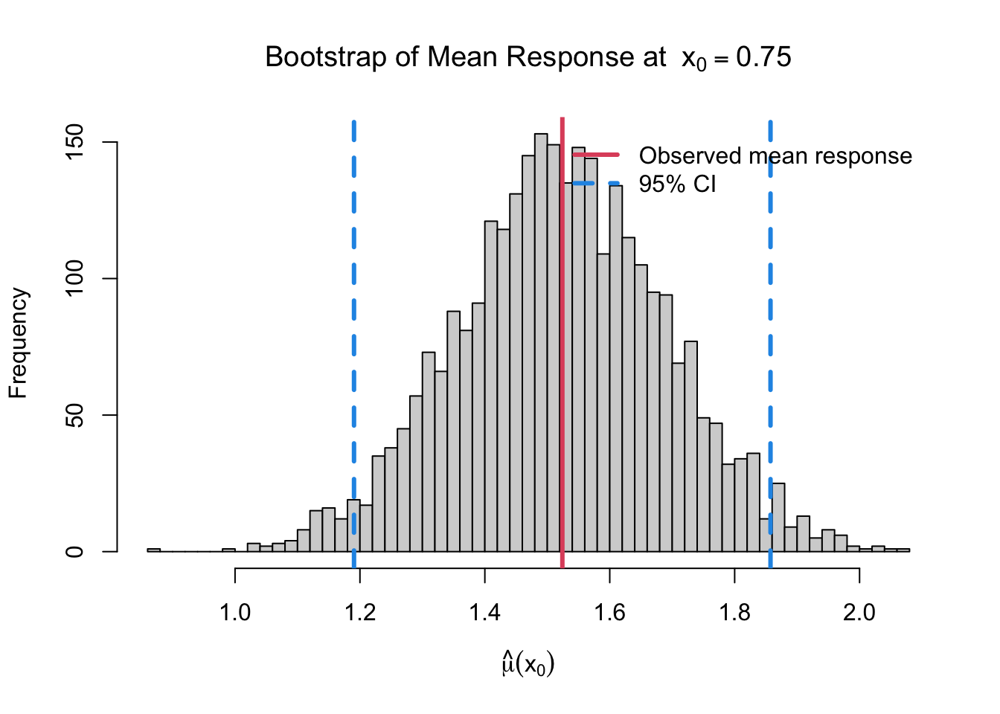

Bootstrap sampling distribution of the mean response at $x_0$ with 95% percentile CI.

------------------------------------------------------------------------

## 5.5 Prediction Interval for $y_0$

When making confidence intervals for $\mu_{Y| x_0}$, we simply computed $$\mu_{Y| x_0}=b_0^*+b_1^*x_0.$$ This is *so* close to predicting the point $y_0$! Now, we just need to add a randomly sampled observed residual $e^*$: $$y_0=b_0^*+b_1^*x_0+e^*.$$

------------------------------------------------------------------------

## 5.6 Ex: 95% Prediction Interval for $y_0$

Code

``` r
set.seed(702)
B <- 3000
y0_star <- numeric(B)
for(b in 1:B){
  y_star <- yhat + sample(ehat, n, replace = TRUE) # same as before
  fit_star <- lm(y_star ~ x) # same as before
  coeff <- coef(fit_star) # same as before
  m_x0_star <- coeff[1] + coeff[2]*x0 # same as before
  e_new <- sample(ehat, 1, replace = TRUE) # emulate new noise
  y0_star[b] <- m_x0_star + e_new # add noise to mean
}

pi_y0 <- quantile(y0_star, c(0.025, 0.975))
c(x0 = x0, pred_lower = pi_y0[1], pred_upper = pi_y0[2])
```

                  x0  pred_lower.2.5% pred_upper.97.5% 
           0.7500000       -0.1155242        3.3273678 

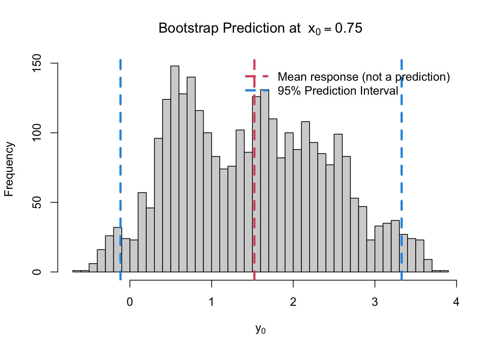

Bootstrap prediction interval for a new response $y_0$ at $x_0$.

------------------------------------------------------------------------

## 5.7 Visualizing the Intervals

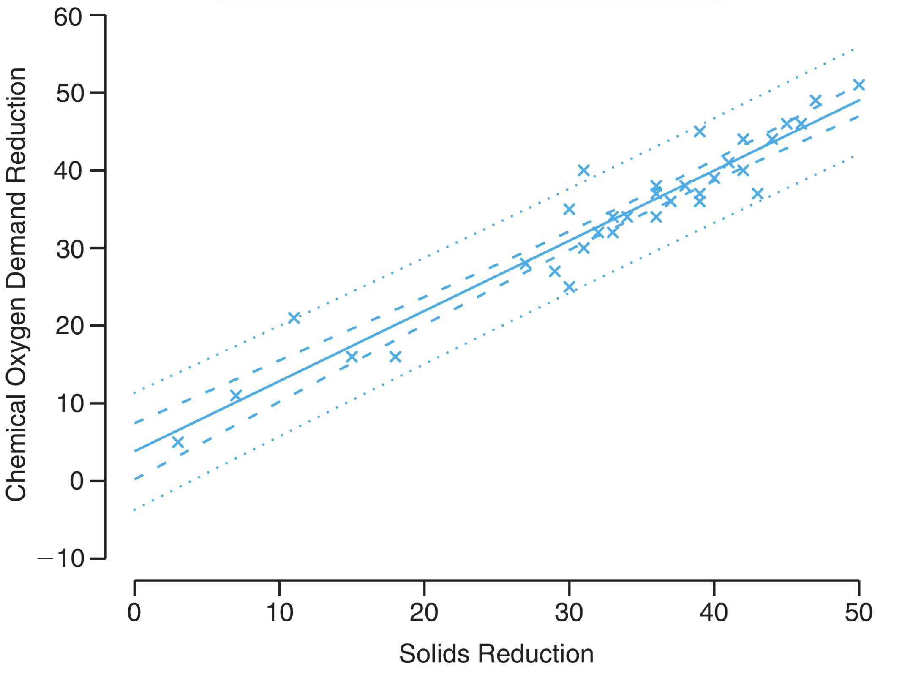

Confidence interval is the dashed line, whereas prediction interval is the dotted lined. Note that the prediction interval has more uncertainty.

------------------------------------------------------------------------

## 5.8 Breakout \#2

1.  Explain the difference between the confidence interval on $\mu_{Y|x_0}$ and the prediction interval on $y_0$.
2.  Explain (in words) how to conduct a randomization test for $H_0: \beta_1=0$. Does this approach make sense to test $H_0:\beta_0=0$?
3.  Using the following simulated data, test $H_0: \beta_1=0$ and provide a 95% prediction interval for $y_0$ given $x_0=3.14$.

Code

``` r
set.seed(702)
n <- 57; beta0 <- 0.1; beta1 <- 0.3; sigma <- 0.5
x <- rgamma(n, 1.3, 0.2) # fixed x
y <- beta0 + beta1*x + rnorm(n, 0, sigma) # observed y
```

# 6 Analysis of Variance (ANOVA)

------------------------------------------------------------------------

## 6.1 Is our model good?

- At the moment, we are only using one independent variable, so it’s very likely that our predictions may be bad if several independent variables impact the response.
- Additionally, we are only considering linear relationships between $x$ and $y$. If there also exists a nonlinear relationship, we should expect that our predictions won’t be *that* good.
- So, how can we tell if our linear model is doing a good job?

------------------------------------------------------------------------

## 6.2 ANOVA

In the analysis-of-variance (ANOVA) approach, we break-up the total variation in the response into meaningful components that are then observed and treated to analyze the quality of our fitted line.

- Previously, we have seen that $SST=SSR+SSE$, where the $SSR$ (the regression sum of squares) reflects the amount of variation in the $y$-values explained by the model and the $SSE$ reflects variation about the regression line.

------------------------------------------------------------------------

## 6.3 Visualizing Variation


Comparing SST, SSE, and SSR.

------------------------------------------------------------------------

## 6.4 ANOVA Table

We typically summarize the components of variation via an ANOVA table:

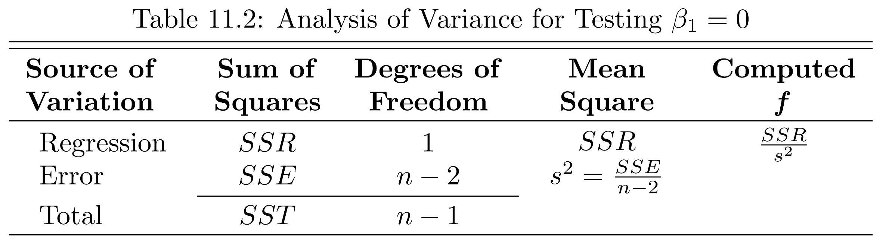

Example of an ANOVA table.

------------------------------------------------------------------------

## 6.5 ANOVA in `R`

We can obtain an ANOVA table in `R` using `anova()`:

Code

``` r
set.seed(702)
n <- 57; beta0 <- 0.1; beta1 <- 0.3; sigma <- 0.5
x <- rgamma(n, 1.3, 0.2) # fixed x
y <- beta0 + beta1*x + rnorm(n, 0, sigma) # observed y

## fit regression
lm_fit <- lm(y ~ x)
anova(lm_fit) # print ANOVA table
```

    Analysis of Variance Table

    Response: y
              Df  Sum Sq Mean Sq F value    Pr(>F)    
    x          1 207.956  207.96  769.08 < 2.2e-16 ***
    Residuals 55  14.872    0.27                      
    ---
    Signif. codes:  0 '***' 0.001 '**' 0.01 '*' 0.05 '.' 0.1 ' ' 1

So, $SSR=207.956$ and $SSE=14.872$. In the top right, the $p$-value for the hypothesis test $H_0:\beta_1=0$ vs $H_a:\beta_1\ne 0$ is $2.2\times10^{-16}$, so we’d certainly reject $H_0$!

# 7 Data Plots and Transformations

------------------------------------------------------------------------

## 7.1 No Linear? No Problem!

In many situations, we may want to work with a model in which either $x$ or $y$ is used in a nonlinear way. So, we might be interested in **transforming** the data. For example, maybe we regress $y$ on $\log(x)$.

- A model in which $x$ or $y$ is transformed can still be a linear model. We call a model *linear* if it is linear in the parameters.
- Let’s see some examples…

------------------------------------------------------------------------

## 7.2 Linear or Nonlinear?

1.  $y_i=\beta_0+\beta_1\log(x_i)+\epsilon_i$

- **Linear**! This model is linear in the parameters $\beta_0$ and $\beta_1$.

2.  $y_i=\beta_0+\beta_1x^{\beta_2}+\epsilon_i$

- **Nonlinear**! This model is not linear in $\beta_2$.

3.  $\log(y_i)=\beta_0+\beta_1\log(x_i)+\epsilon_i$

- **Linear**! This model is linear in the parameters $\beta_0$ and $\beta_1$.

------------------------------------------------------------------------

## 7.3 Why Consider Transformations?

We might find that a fitted line through $\{(x_i,y_i):i=1,\dots,n\}$ is not a good idea, but it *could* be a good idea if we transformed either $\mathbf{x}$ or $\mathbf{y}$ (or both).

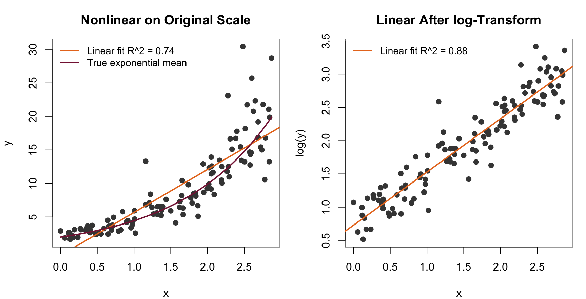

Left: Nonlinear relationship on original scale. Right: Linear relationship after log-transforming y.

------------------------------------------------------------------------

## 7.4 Some Useful Transformations

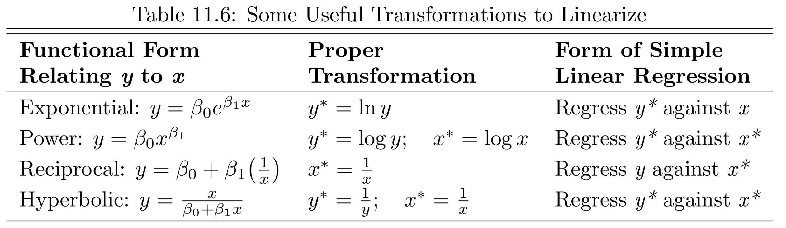

------------------------------------------------------------------------

## 7.5 Some Useful Transformations

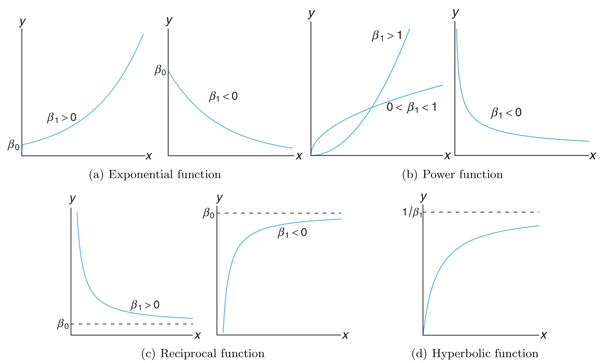

Examples of functions that can easily be linearized using the previous table.

------------------------------------------------------------------------

## 7.6 Notes on Transformations

- Often, if a transformed model has a proper *additive error structure*, then the untransformed model has a different type of error structure.
- When $y$ is transformed, model comparison methods (e.g., comparing $R^2$) should be based on values of the residuals in the metric of the untransformed response. This way, comparisons are “proper” and exist in the same space.
  - Ex: If we compare a model on $y$ with a model on $\log(y)$, we need to compute $R^2$ based on the original scale.

------------------------------------------------------------------------

## 7.7 Diagnostic Plots of Residuals

In many cases, plotting the residuals can help us detect violations of assumptions. We often assume that $\epsilon_i$ are independent $N(0,\sigma)$ random variables. Although we do not observe $\epsilon_i$, we may treat the residuals as a proxy to $\epsilon_i$. Therefore, by looking at our residuals, we can determine if our assumptions on $\epsilon_i$ are invalid.

------------------------------------------------------------------------

## 7.8 Nonhomogeneous Variance

Homogeneous variance is an important assumption made in regression analysis. Violations of this assumption can often be detected through residual plots.

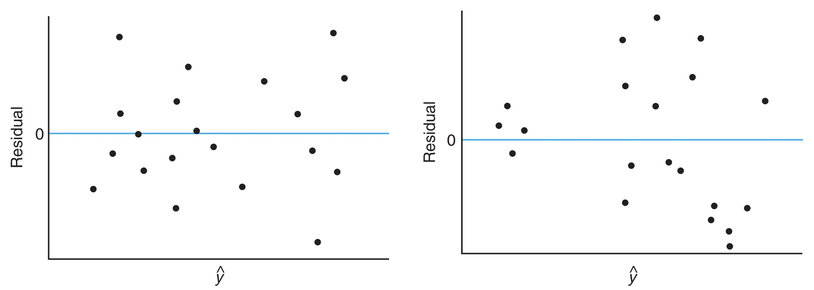

Homogeneous variance looks like a constant magnitude of residuals (left). Nonhomogeneous variance looks like a varying amount of residual (right).

------------------------------------------------------------------------

## 7.9 Ex: Residual Plots

Code

``` r
## simulate data
set.seed(702)
n <- 57; beta0 <- 0.1; beta1 <- 0.3; sigma <- 0.5
x <- rgamma(n, 1.3, 0.2) # fixed x
y <- beta0 + beta1*x + rnorm(n, 0, sigma) # observed y

## fit regression
lm_fit <- lm(y ~ x)
resids <- resid(lm_fit)

## residual plot
plot(lm_fit$fitted, resids, pch = 19, col = "#444444",
       main = "Residual Plot",
       xlab = "Fitted Values", ylab = "Residual")
abline(h=0, col = "#E87722", lwd = 2)
```

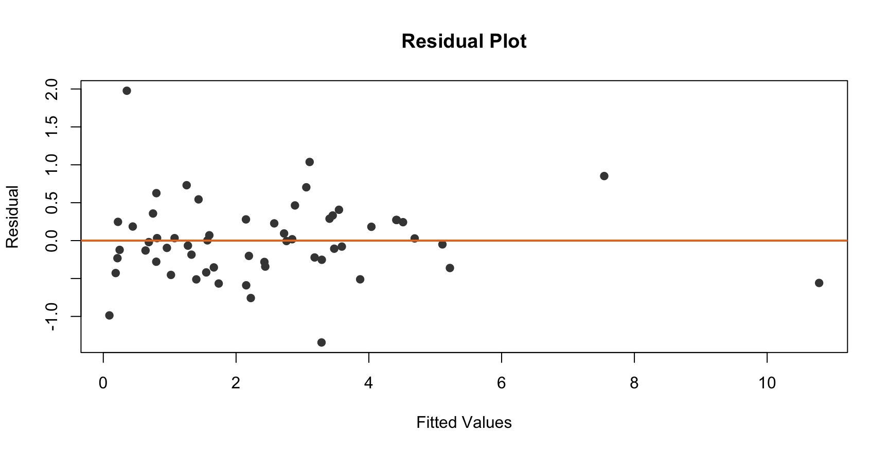

An example of a residual plot.

------------------------------------------------------------------------

## 7.10 Q-Q Plots

Another important assumption that we make is that the residuals are normally distributed. A Q-Q plot is used to assess this assumption.

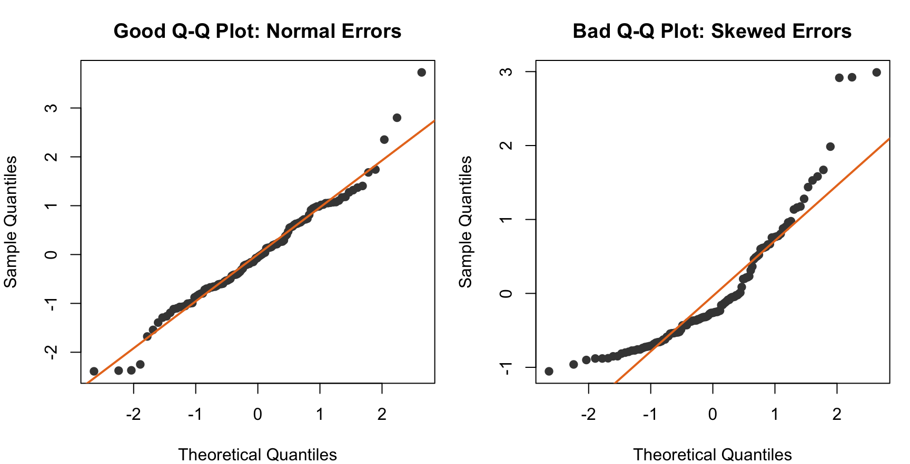

Left: Residuals approximately follow a Normal distribution (good). Right: Heavy-tailed, skewed residuals (bad).

------------------------------------------------------------------------

## 7.11 Ex: Q-Q Plots

Code

``` r
## simulate data
set.seed(702)
n <- 57; beta0 <- 0.1; beta1 <- 0.3; sigma <- 0.5
x <- rgamma(n, 1.3, 0.2) # fixed x
y <- beta0 + beta1*x + rnorm(n, 0, sigma) # observed y

## fit regression
lm_fit <- lm(y ~ x)
resids <- resid(lm_fit)

## Q-Q plot
qqnorm(resids, pch = 19, col = "#444444",
       main = "Q-Q Plot",
       xlab = "Theoretical Quantiles", ylab = "Sample Quantiles")
qqline(resids, col = "#E87722", lwd = 2)
```

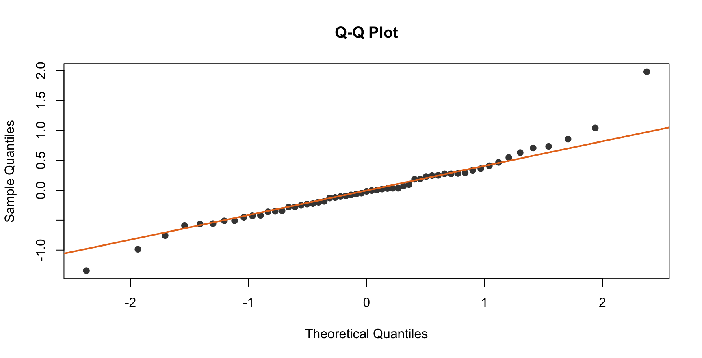

An example of a Q-Q plot.

# 8 Correlation

------------------------------------------------------------------------

## 8.1 Two Random Variables

Up until this point, we have assumed that $x$ is a scientific/physical variable but not a random variable. However in many scenarios, it is realistic to assume that both $X$ and $Y$ are random variables and the measurements $\{(x_i,y_i):i=1,\dots,n\}$ are observations from a population having the joint density function $f_{X,Y}(x,y)$.

- If $X$ and $Y$ are both random variables, we might want to know their relationship…

------------------------------------------------------------------------

## 8.2 Correlation Analysis

**Correlation analysis** aims to measure the strength of relationships between two variables ($X$ and $Y$) with a quantity called the **sample correlation coefficient**: $$r=b_1\sqrt{\frac{S_{xx}}{S_{yy}}}=\frac{S_{xy}}{\sqrt{S_{xx}S_{yy}}},$$ where $S_{xx}=\sum^n_{i=1}(x_i-\bar{x})^2$, $S_{yy}=\sum^n_{i=1}(y_i-\bar{y})^2$, and $S_{xy}=\sum^n_{i=1}(x_i-\bar{x})(y_i-\bar{y})$.

------------------------------------------------------------------------

## 8.3 The Correlation Coefficient

Our sample correlation coefficient $r$ is an estimate of the unknown population correlation coefficient $\rho_{XY}=\frac{\sigma_{XY}}{\sigma_X\sigma_Y}$ (which we saw in Ch. 4).

- Like $\rho_{XY}$, it is true that $-1\le r\le 1$.
- Unlike $\rho_{XY}$, it is tricky to compare the magnitude of $r$. While $r=0.3$ and $r=0.6$ both indicate positive correlations, it is **not** true that $r=0.6$ indicates a linear relationship that is twice as strong as $r=0.3$.

------------------------------------------------------------------------

## 8.4 Coefficient of Determination

The **sample coefficient of determination** $r^2$ represents the proportion of the variation of $S_{yy}$ explained by the regression of $Y$ on $x$ (i.e., SSR): $$r^2=\left(\frac{S_{xy}}{\sqrt{S_{xx}S_{yy}}}\right)^2=\frac{SSR}{S_{yy}}.$$ So, a correlation of $0.6$ means that $0.36$ (or $36\%$) of the total variation of $Y$ is accounted for by a linear relationship with $X$.

------------------------------------------------------------------------

## 8.5 Breakout \#3

Code

``` r
## simulate data
set.seed(702)
n <- 150
alpha <- 1.8; beta <- 2.3
x <- runif(n, 0.5, 5)
y <- alpha * x^beta * rlnorm(n, meanlog = 0, sdlog = 0.25)
```

1.  Fit a SLR model to the simulated data above. Check the residuals and determine an appropriate transformation. Refit the model and report $r^2$.
2.  In your own words, explain what SSR, SSE, and SST represent and how they are related.
3.  You fit two different models to $\{(x_i,y_i):i=1,\dots,n\}$ and get $r_1=0.7$ and $r_2=0.75$. Which model is “better” and how much more variation does it explain?

# 9 Extending to Multiple Linear Regression

------------------------------------------------------------------------

## 9.1 From SLR to MLR

So far, we have used a single independent variable $x$ to explain the response $y$. But the real world is rarely so simple! Most outcomes depend on **many** predictors:

- A house’s price depends on size, location, age, number of bedrooms
- A patient’s recovery time depends on age, severity, treatment, comorbidities
- A circuit’s failure rate depends on temperature, voltage, humidity

Let’s extend the SLR model to handle multiple independent variables!

------------------------------------------------------------------------

## 9.2 The MLR Model

The **multiple linear regression (MLR) model** with $k$ independent variables is $$Y=\beta_0+\beta_1x_1+\beta_2x_2+\dots+\beta_kx_k+\epsilon,$$ where $\beta_0$ is still the **intercept**, each $\beta_j$ is now a **partial slope**, and $\epsilon$ has $E(\epsilon)=0$ and $\text{Var}(\epsilon)=\sigma^2$.

- We still call this *linear*: it is linear in the parameters $\beta_0,\beta_1,\dots,\beta_k$.
- SLR is just the special case of MLR with $k=1$!

------------------------------------------------------------------------

## 9.3 Interpreting the Coefficients

In SLR, $\beta_1$ was “the change in $y$ per unit change in $x$.” In MLR, this gets a small but **important** twist:

- $\beta_j$ is the expected change in $y$ for a one-unit increase in $x_j$, **holding all other predictors fixed**.
- That “holding constant” condition is what makes MLR powerful: it isolates the effect of $x_j$ from the effects of the other variables.
- This is why the $\beta_j$ in MLR can differ from the $\beta_1$ you would estimate by regressing $y$ on $x_j$ alone!

------------------------------------------------------------------------

## 9.4 From a Line to a Hyperplane

Geometrically, what we are estimating gets bigger:

- In SLR ($k=1$), the fitted regression is a *line* in 2D.
- In MLR with $k=2$ predictors, it is a *plane* in 3D.
- In MLR with $k\ge 3$ predictors, it is a **hyperplane** in $(k+1)$-dimensional space.

We cannot visualize a hyperplane, but the math handles it just fine!

------------------------------------------------------------------------

## 9.5 Ex: Visualizing the Fitted Plane

Code

``` r
## simulate MLR data with k=2
set.seed(702)
n <- 60
x1 <- runif(n, 0, 10)
x2 <- runif(n, 0, 10)
y  <- 1 + 0.5*x1 + 1.2*x2 + rnorm(n, 0, 1.5) # true betas: 1, 0.5, 1.2

## fit MLR
fit <- lm(y ~ x1 + x2)
b <- coef(fit)

## build a grid for the fitted plane
g <- 25
x1_grid <- seq(min(x1), max(x1), length.out = g)
x2_grid <- seq(min(x2), max(x2), length.out = g)
y_grid <- outer(x1_grid, x2_grid,
                 function(a, d) b[1] + b[2]*a + b[3]*d)

## perspective plot of fitted plane
pmat <- persp(x1_grid, x2_grid, y_grid,
              theta = 30, phi = 20,
              col = "gray90", border = "gray60",
              xlab = "x1", ylab = "x2", zlab = "y",
              ticktype = "detailed",
              main = "Fitted Plane in MLR (k = 2)")

## overlay observed points
pts <- trans3d(x1, x2, y, pmat)
points(pts, pch = 19, col = "#E87722")
```

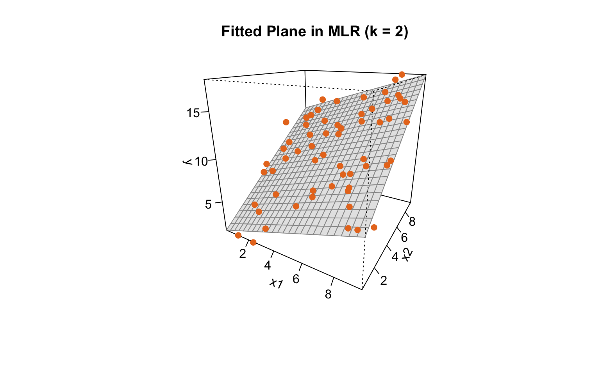

An MLR fit with $k=2$ predictors. The fitted regression is a plane in 3D, and observations sit above or below it.

------------------------------------------------------------------------

## 9.6 Matrix Formulation

Carrying around $k+1$ slope sums quickly becomes unwieldy. So, we stack everything into matrices: $$\mathbf{Y}=\begin{pmatrix}y_1\\\vdots\\y_n\end{pmatrix},\;\; \mathbf{X}=\begin{pmatrix}1 & x_{11} & \cdots & x_{1k}\\ \vdots & \vdots & \ddots & \vdots\\ 1 & x_{n1} & \cdots & x_{nk}\end{pmatrix},\;\; \boldsymbol{\beta}=\begin{pmatrix}\beta_0\\\beta_1\\\vdots\\\beta_k\end{pmatrix}.$$ Then, the entire MLR model is concisely written as $$\mathbf{Y}=\mathbf{X}\boldsymbol{\beta}+\boldsymbol{\epsilon}.$$

------------------------------------------------------------------------

## 9.7 Least Squares in Matrix Form

Just as in SLR, we want to choose $\mathbf{b}=(b_0,b_1,\dots,b_k)'$ to minimize $$SSE=\sum^n_{i=1}e_i^2=(\mathbf{Y}-\mathbf{X}\mathbf{b})'(\mathbf{Y}-\mathbf{X}\mathbf{b}).$$ Differentiating with respect to $\mathbf{b}$ and setting equal to $\mathbf{0}$ gives the normal equations $\mathbf{X}'\mathbf{X}\mathbf{b}=\mathbf{X}'\mathbf{Y}$, which solve to $$\mathbf{b}=(\mathbf{X}'\mathbf{X})^{-1}\mathbf{X}'\mathbf{Y}.$$

------------------------------------------------------------------------

## 9.8 Ex: Fitting MLR in `R`

Fitting MLR in `R` is just as easy as SLR:

Code

``` r
## simulate data
set.seed(702)
n <- 60
x1 <- runif(n, 0, 10)
x2 <- runif(n, 0, 10)
y  <- 1 + 0.5*x1 + 1.2*x2 + rnorm(n, 0, 1.5) # true betas: 1, 0.5, 1.2

## fit MLR via lm()
mlr_fit <- lm(y ~ x1 + x2)
mlr_fit$coefficients # pretty close to the truth!
```

    (Intercept)          x1          x2 
      0.8402190   0.5628845   1.2451464 

Code

``` r
## or directly via matrix algebra
X <- cbind(1, x1, x2)
solve(t(X) %*% X) %*% t(X) %*% y # same answer!
```

            [,1]
       0.8402190
    x1 0.5628845
    x2 1.2451464

------------------------------------------------------------------------

## 9.9 What Stays the Same

A lot of what we learned for SLR carries over directly to MLR:

- Residuals $e_i=y_i-\hat{y}_i$ are still our window into model errors.
- We still partition variation: $SST=SSR+SSE$.
- ANOVA tables, $R^2$, residual plots, and Q-Q plots all still apply.
- We still need to check the homogeneous variance and normality assumptions on the residuals.
- Confidence and prediction intervals work the same way; we just plug in a vector $\mathbf{x}_0$ instead of a single $x_0$.

------------------------------------------------------------------------

## 9.10 What Changes: Adjusted $R^2$

In MLR, $R^2$ **never decreases** when you add a predictor, even if that predictor is pure noise! To penalize predictors that don’t pull their weight, we use the **adjusted $R^2$**: $$R^2_{\text{adj}}=1-\frac{SSE/(n-k-1)}{SST/(n-1)}.$$

- $R^2_{\text{adj}}$ can actually go *down* when a useless predictor is added.
- Use $R^2_{\text{adj}}$ (not $R^2$) to compare models with different numbers of predictors!

------------------------------------------------------------------------

## 9.11 What Changes: Multicollinearity

When two or more predictors are highly correlated with each other, we have **multicollinearity**:

- The matrix $\mathbf{X}'\mathbf{X}$ becomes nearly singular, so $(\mathbf{X}'\mathbf{X})^{-1}$ is unstable.
- Coefficient estimates become highly variable and harder to interpret.
- A predictor may look insignificant simply because another predictor is doing similar work.

------------------------------------------------------------------------

## 9.12 Inference: Two Kinds of Tests

In SLR, testing $H_0:\beta_1=0$ tested whether the model was useful. In MLR, we now have **two** approaches:

1.  **Overall $F$-test** for $H_0:\beta_1=\beta_2=\dots=\beta_k=0$. Is *any* predictor useful?
2.  **Individual $t$-tests** for $H_0:\beta_j=0$. Is predictor $x_j$ useful, *given the others*?

These can disagree! Multicollinearity can produce a significant $F$-test with no significant individual $t$-tests.

------------------------------------------------------------------------

## 9.13 Ex: Inference in `R`

Code

``` r
## simulate data
set.seed(702)
n <- 60
x1 <- runif(n, 0, 10)
x2 <- runif(n, 0, 10)
x3 <- rnorm(n, 0, 1) # a noise predictor
y  <- 1 + 0.5*x1 + 1.2*x2 + rnorm(n, 0, 1.5) # x3 is NOT in the truth

## fit and inspect
mlr_fit <- lm(y ~ x1 + x2 + x3)
summary(mlr_fit)
```


    Call:
    lm(formula = y ~ x1 + x2 + x3)

    Residuals:
        Min      1Q  Median      3Q     Max 
    -3.2917 -0.8736 -0.1794  0.9274  4.2983 

    Coefficients:
                Estimate Std. Error t value Pr(>|t|)    
    (Intercept)  1.83577    0.49600   3.701 0.000492 ***
    x1           0.41644    0.06010   6.930 4.52e-09 ***
    x2           1.13184    0.06645  17.033  < 2e-16 ***
    x3          -0.08463    0.17179  -0.493 0.624197    
    ---
    Signif. codes:  0 '***' 0.001 '**' 0.01 '*' 0.05 '.' 0.1 ' ' 1

    Residual standard error: 1.381 on 56 degrees of freedom
    Multiple R-squared:  0.8544,    Adjusted R-squared:  0.8466 
    F-statistic: 109.6 on 3 and 56 DF,  p-value: < 2.2e-16

Note that $x_3$ is correctly flagged as not significant!

------------------------------------------------------------------------

## 9.14 Wrapping Up

MLR is the foundation for much of modern statistics and machine learning. Future extensions:

- **Polynomial regression**: $y=\beta_0+\beta_1x+\beta_2x^2+\dots$ – still linear in $\boldsymbol{\beta}$!
- **Categorical predictors** via dummy (0/1) variables.
- **Interaction terms**: $y=\beta_0+\beta_1x_1+\beta_2x_2+\beta_3x_1x_2+\epsilon$.
- Generalized linear models, mixed-effects models, and beyond.

All from one unifying idea: $\mathbf{Y}=\mathbf{X}\boldsymbol{\beta}+\boldsymbol{\epsilon}.$
