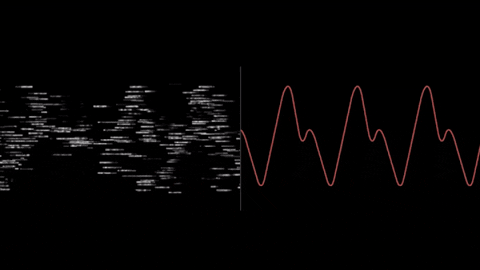

# The Kalman Filter

STAT 4714 — Michael Schwob

## 1 What Is the Kalman Filter?

The Kalman filter is a method for:

- Tracking something that changes over time (e.g., car’s position, stock market, animal movement)
- Using noisy measurements
- Combining **what you expect** with **what you observe**

It produces:

- The **best estimate** of the hidden state at each time step
- A measure of **uncertainty** in that estimate

------------------------------------------------------------------------

## 2 An Analogy

Imagine trying to follow a friend walking in a foggy field.

- You have an idea of how they are moving (speed + direction).
- Occasionally, you see a blurry glimpse of them.

------------------------------------------------------------------------

## 3 An Analogy

The Kalman filter does the following:

1.  **Predict** where your friend should be.
2.  **Update** that prediction using the new (noisy) glimpse.
3.  Repeat as they keep walking.

Over time, your estimate gets better and you stay on track.

------------------------------------------------------------------------

## 4 When to Kalman Filter?

Everywhere things must be tracked or smoothed:

- GPS and navigation systems\
- Self-driving cars tracking pedestrians\
- Robotics (estimating position & velocity)\
- Finance (estimating hidden economic states)\
- Environmental science (filtering noisy sensor data)\
- Weather forecasting (data assimilation)

------------------------------------------------------------------------

## 5 When to Kalman Filter?

Whenever you have:

- A system that changes over time, and
- Noisy measurements

------------------------------------------------------------------------

## 6 Two Key Ideas

Repeatedly do the following:

1.  **Prediction Step**
    - Use the system model to predict the next state.
    - Also predict how uncertain that state is.
2.  **Update Step**
    - Bring in the new measurement (e.g., briefly seeing your friend).
    - Weight the prediction and measurement based on their uncertainties.
    - Produce a new, improved estimate.

------------------------------------------------------------------------

## 7 Ingredients of a Kalman Filter

We assume two ideas:

1.  The state evolves over time.
2.  Measurements are noisy.

The filter combines:

- **Model knowledge** (how states evolve)
- **Data** (noisy observations)

------------------------------------------------------------------------

## 8 A Simple Example

Suppose we want to track a moving car:

- The car tends to move forward steadily.
- GPS provides noisy position measurements.

The Kalman filter:

1.  Predicts where the car should be based on speed
2.  Updates using the GPS measurement
3.  Repeats every time step

**Result**: A smooth, accurate estimate of position, even though GPS is noisy.

------------------------------------------------------------------------

## 9 Notation

**Hidden state** $\mathbf{x}_t$: What we want to estimate (e.g., true position & velocity)

**Observation** $\mathbf{y}_t$: What we measure (noisy)

------------------------------------------------------------------------

## 10 System Equations

- **State evolution (process model)** $$
  \mathbf{x}_t = \mathbf{A}\mathbf{x}_{t-1} + \mathbf{w}_t
  $$

  - $\mathbf{w}_t \sim \text{N}(\boldsymbol0, \mathbf{Q})$ is process noise

- **Measurement equation** $$
  \mathbf{y}_t = \mathbf{H}\mathbf{x}_t + \mathbf{v}_t
  $$

  - $\mathbf{v}_t \sim \text{N}(\boldsymbol0, \mathbf{R})$ is measurement noise

------------------------------------------------------------------------

## 11 Interpreting the System Matrices

These components determine how the filter balances prediction and observation:

- $\mathbf{A}$: how the state moves from one time to the next (e.g., constant velocity model)
- $\mathbf{H}$: how the state is observed (e.g., GPS sees only position, not velocity)
- $\mathbf{Q}$: uncertainty in how the state evolves (e.g., unexpected acceleration)
- $\mathbf{R}$: measurement uncertainty (e.g., GPS noise)

------------------------------------------------------------------------

## 12 The Kalman Filter Cycle

At each time step:

1.  **Predict** the next state and its uncertainty\
2.  **Update** using the new measurement

This produces the optimal estimate $\hat{\mathbf{x}}_t$ and its uncertainty $\mathbf{P}_t$.

------------------------------------------------------------------------

## 13 Step 1: Prediction

Based on the system model:

- Predict where the state *should be* now.
- Update the uncertainty in that prediction.

This uses:

- Last state estimate\
- Knowledge of how the system changes\
- Process noise (uncertainty in how things move)

------------------------------------------------------------------------

## 14 Step 1: Prediction

Predicted state: $$\hat{\mathbf{x}}_{t|t-1} = \mathbf{A}\,\hat{\mathbf{x}}_{t-1|t-1}$$

Predicted covariance (uncertainty): $$\mathbf{P}_{t|t-1} = \mathbf{AP}_{t-1|t-1} \mathbf{A}^\top + \mathbf{Q}$$

Interpretation:

- Use the model to predict where the state should be
- Add uncertainty from the process noise $\mathbf{Q}$

------------------------------------------------------------------------

## 15 Step 2: Update

A noisy measurement arrives.

The Kalman filter:

- Compares the prediction to the new observation
- Calculates how much to trust each
- Blends them together using the **Kalman gain**

If the measurement is noisy → trust prediction more. If prediction is uncertain → trust measurement more.

------------------------------------------------------------------------

## 16 The Kalman Gain

The Kalman gain is a weighting factor:

- High gain → rely more on the new measurement\
- Low gain → rely more on the prediction

It is chosen to **minimize the uncertainty** of the updated estimate.

Think of it as the balance between your confidence in your model and your confidence in your data.

------------------------------------------------------------------------

## 17 Step 2: Update

Innovation (difference between measurement and prediction): $$
\mathbf{z}_t = \mathbf{y}_t - \mathbf{H}\hat{\mathbf{x}}_{t|t-1}
$$

Innovation covariance: $$
\mathbf{S}_t = \mathbf{HP}_{t|t-1} \mathbf{H}^\top + \mathbf{R}
$$

Kalman Gain: $$
\mathbf{K}_t = \mathbf{P}_{t|t-1} \mathbf{H}^\top \mathbf{S}_t^{-1}
$$ —

## 18 Updated State

Updated state estimate: $$
\hat{\mathbf{x}}_{t|t} = \hat{\mathbf{x}}_{t|t-1} + \mathbf{K}_t\,\mathbf{z}_t
$$

Updated covariance: $$
\mathbf{P}_{t|t} = (\mathbf{I} - \mathbf{K}_t \mathbf{H}) \mathbf{P}_{t|t-1}
$$

Interpretation:

- Adjust the prediction using the measurement
- Reduce uncertainty based on how informative the measurement was

------------------------------------------------------------------------

## 19 Full Kalman Filter (Compact)

**Predict at time $t$:** $$
\hat{\mathbf{x}}_{t|t-1} = \mathbf{A}\hat{\mathbf{x}}_{t-1|t-1}
$$ $$
\mathbf{P}_{t|t-1} = \mathbf{AP}_{t-1|t-1} \mathbf{A}^\top + \mathbf{Q}
$$

------------------------------------------------------------------------

## 20 Full Kalman Filter (Compact)

**Update at time $t$:** $$
\mathbf{z}_t = \mathbf{y}_t - \mathbf{H}\hat{\mathbf{x}}_{t|t-1}
$$ $$
\mathbf{S}_t = \mathbf{HP}_{t|t-1} \mathbf{H}^\top + \mathbf{R}
$$ $$
\mathbf{K}_t = \mathbf{P}_{t|t-1}\mathbf{H}^\top \mathbf{S}_t^{-1}
$$ $$
\hat{\mathbf{x}}_{t|t} = \hat{\mathbf{x}}_{t|t-1} + \mathbf{K}_t\mathbf{z}_t
$$ $$
\mathbf{P}_{t|t} = (\mathbf{I} - \mathbf{K}_t \mathbf{H}) \mathbf{P}_{t|t-1}
$$

------------------------------------------------------------------------

## 21 Why is This Optimal?

Under the assumptions:

- Linear relationships ($\mathbf{A}$, $\mathbf{H}$)
- Gaussian noise ($\mathbf{Q}$, $\mathbf{R}$)
- Known system uncertainties

The Kalman filter produces **the best possible estimate of the state** in the sense of minimizing mean squared error.

No other method can improve on these estimates without adding more information.

------------------------------------------------------------------------

## 22 Comparing SLR/ML with KF

SLR/ML:

- Learn a mapping from inputs to outputs ($\mathbf{x}$ → $y$)
- Uses fixed datasets

Kalman filtering:

- Learns a *state* over time
- Continually updates based on new data
- Handles uncertainty explicitly

It is **not** a prediction model for outputs. It **is** a dynamic estimation method for hidden states.

------------------------------------------------------------------------

## 23 Topics Worth Exploring Next

- Kalman filter equations (matrix form)
- Tracking position + velocity together
- Extended Kalman Filter (nonlinear systems)
- Unscented Kalman Filter (more accurate for nonlinear problems)
- Particle filters (non-Gaussian and non-linear systems)
- Kalman filtering in R or Python:
  - R: `dlm`, `FKF`, `KFAS`
  - Python: `filterpy`, `pydlm`, `statsmodels`

------------------------------------------------------------------------

## 24 A Brief History of the KF

- **1960 — Rudolf E. Kálmán** publishes the Kalman filter.\
  His key insight: combine noisy measurements with a physical model to get an optimal estimate.

- **Early 1960s — NASA adopts it for the Apollo program**

  - Used to track spacecraft position, velocity, and trajectory\
  - Allowed navigation with limited, noisy sensor data\
  - First major engineering breakthrough driven by the filter

------------------------------------------------------------------------

## 25 A Brief History of the KF

- **1970s–1990s — Expands across electrical engineering**
  - Radar tracking
  - Control systems (state estimation in feedback loops)\
  - Guidance and navigation for aircraft and missiles\
  - Signal processing

------------------------------------------------------------------------

## 26 A Brief History of the KF

The Kalman filter remains one of the most influential tools in **ECE**, powering systems that must estimate real-world states from imperfect data.

- **2000s–today — Everywhere in modern EE systems**
  - GPS receivers\
  - Autonomous vehicles\
  - Drones and robotics\
  - Wireless communication and channel estimation\
  - Sensor fusion in smartphones and wearables

------------------------------------------------------------------------

## 27 Wrapping Up

- The Kalman filter estimates a **hidden state** that changes over time.\
- It combines:
  - **Prediction** from a system model\
  - **Update** from noisy measurements\
- The key components:
  - State transition matrix $\mathbf{A}$
  - Observation matrix $\mathbf{H}$
  - Noise covariances $\mathbf{Q}$ and $\mathbf{R}$

------------------------------------------------------------------------

## 28 Wrapping Up

- Two-step cycle at every time point:
  1.  **Predict** the next state and uncertainty\
  2.  **Update** using the new observation\
- Produces the **best linear unbiased estimate** under Gaussian assumptions.\
- Widely used in navigation, robotics, finance, sensor fusion, and environmental science.

**Idea**: Blend what you expect with what you observe in the most statistically optimal way.
